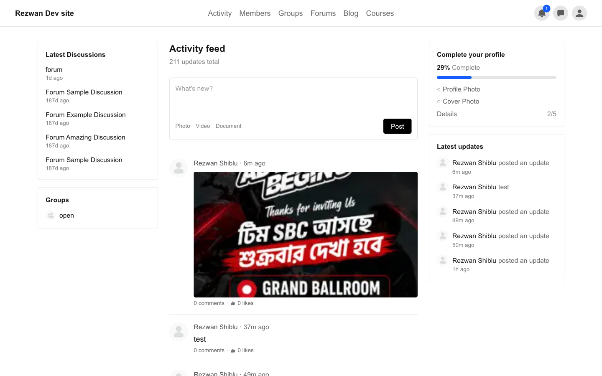

# BuddyBoss Headless

**🔗 Live demo:** [buddyboss.vercel.app](https://buddyboss.vercel.app)



A headless frontend for a real [BuddyBoss](https://www.buddyboss.com/) community
site — activity feed, member profiles, groups, forums, messages, notifications,
blog, and LearnDash courses — built with Next.js App Router on top of
BuddyBoss's own REST API. No plugin was written for content; the browser never
talks to WordPress directly.

This is a practice/portfolio project built almost entirely with
[Claude Code](https://claude.com/claude-code), working against a **live**
WordPress dev site the whole way through, with **every push to `main`
deploying automatically to Vercel from day one.** This README is as much
about *how* it was built as *what* it is — see [Development story](#development-story)
below.

---

## Table of contents

- [Architecture](#architecture)
- [Tech stack](#tech-stack)
- [Features](#features)
- [Development story](#development-story)
  - [Day 1: live site, instant deploys](#day-1-live-site-instant-deploys)
  - [Connecting to the live WordPress site (SFTP/SSH)](#connecting-to-the-live-wordpress-site-sftpssh)
  - [Working directly against a live site](#working-directly-against-a-live-site)
  - [Testing: local and live, automated and manual](#testing-local-and-live-automated-and-manual)
  - [Real bugs found and fixed](#real-bugs-found-and-fixed-the-actual-learning)
  - [Hitting Vercel's free-plan limits](#hitting-vercels-free-plan-limits)
- [Project structure](#project-structure)
- [Running it locally](#running-it-locally)
- [Deployment](#deployment)
- [Project docs](#project-docs)

---

## Architecture

The browser never talks to WordPress. Next.js sits in the middle as a
backend-for-frontend (BFF):

```
Browser  --(cookie)-->  Next.js server  --(bearer token)-->  WordPress (buddyboss/v1 REST)
```

- No CORS to configure — the browser only ever talks to the Next.js app.
- Auth tokens live in `httpOnly` cookies, read server-side. They never reach
  client JavaScript.
- Every WordPress call goes through a single transport module
  (`packages/api-client/src/wp-fetch.ts`). No exceptions, no scattered `fetch()`
  calls to the WP host.

## Tech stack

- **Next.js (App Router)**, TypeScript strict, Tailwind CSS, Biome (lint + format)
- **pnpm workspaces** — `apps/web` (the app) + `packages/types` and
  `packages/api-client` (shared, generated-from-real-data types and the
  BuddyBoss REST client)
- **TanStack Query** for client-side infinite scroll, backed by Server Actions
- **Zod** at every API boundary — BuddyBoss's REST API is loosely typed
  (numbers as strings, `false` instead of `null`), so every response is
  coerced and defended against, not trusted
- **Vitest** (unit) + **Playwright** (e2e) for automated tests, plus the
  **Playwright MCP** for live, interactive browser verification during
  development
- **Vercel** for hosting, auto-deploying on every push to `main`
- A small **custom JWT plugin** (`wp/plugin-headless`) is the *only* custom
  PHP in the whole project — BuddyBoss's REST API assumes cookie + nonce
  auth, which doesn't work from a separate Next.js server. Everything else
  rides on BuddyBoss's own shipped REST API (153 routes across all 16 active
  components).

## Features

Built in phases, public reads first (since BuddyBoss's API allows anonymous
access), auth in the middle, messages/notifications last:

- **Activity** — global feed, per-member and per-group scoped feeds, post
  composer (text, photo, video, document), comments, likes
- **Members** — directory with search/pagination, profile pages, xProfile
  fields, friend requests
- **Groups** — directory, detail page, join/leave/request-to-join, member
  list, group-scoped activity feed with its own composer
- **Forums** — forum list, topics, replies (bbPress under the hood)
- **Messages** — inbox, threads, send/reply, read state
- **Notifications** — list, mark read, unread badge (polling)
- **Blog** — list + single post (`wp/v2/posts`, WordPress core — not a
  BuddyBoss route)
- **LearnDash courses** — catalog, enrollment, lessons/topics, completion
  tracking, via the same REST API BuddyBoss's own mobile app uses
- **Auth** — login/logout/signup, JWT access + refresh tokens, rate limiting,
  protected routes
- Production hardening: caching audit, real 404/500 pages, cookie flags per
  environment, Lighthouse pass, cache-revalidation webhook from WordPress

## Development story

### Day 1: live site, instant deploys

Most tutorials build a Next.js app for a while and deploy it at the end. This
project did the opposite on purpose: **Vercel was connected before a single
feature existed**, in Phase 1, and every push to `main` has deployed
automatically ever since. There has never been a separate "deployment phase."

The reasoning: environment bugs — hardcoded hostnames, image domains, cookie
flags, caching assumptions — are cheap to fix when there are ten files and
expensive when there are two hundred. Deploying from day one means the *real*
production environment (not `localhost`) is catching those bugs the whole
way through, not just at the end. It also means there's always a real,
shareable URL — [buddyboss.vercel.app](https://buddyboss.vercel.app) — instead
of a promise that it'll exist eventually.

Both local dev and the Vercel deploy point at the **same** WordPress backend
(a dedicated dev site), configured entirely through a `WP_URL` environment
variable — never a hardcoded hostname anywhere in the codebase, since local
and production would otherwise silently diverge.

### Connecting to the live WordPress site (SFTP/SSH)

There is no local WordPress install in this project at all — no Local by
Flywheel, no Docker WordPress, nothing. Every piece of backend work (running
WP-CLI, inspecting the database, pushing PHP changes, pulling a reference
copy of the site) happens directly against the real, live WordPress dev site
over **SSH/SFTP**, through a handful of small scripts instead of raw `ssh`/
`rsync` commands:

```bash
./scripts/wp <args>          # WP-CLI on the remote site, over SSH
./scripts/pull                # mirror the remote WordPress root into ./remote/ (read-only reference)
./scripts/push <subpath>      # dry-run by default; add --go to actually apply
./scripts/push-plugin         # deploys the custom JWT auth plugin specifically
```

All four are thin wrappers around `ssh`/`rsync`, authenticated with an SSH
key, reading connection details (host, port, user, key path, remote path)
from a single gitignored `.env.deploy` file that never touches version
control. `./scripts/push` and `./scripts/push-plugin` are **dry-run by
default** — they print exactly what would change, and only apply it when you
add `--go`, since this is a live, shared server, not a sandbox.

This setup meant that from the very first day, "does this actually work
against real WordPress" was always a live, verifiable question, not
something guessed at against sample fixtures.

### Working directly against a live site

Because there's no staging environment or local WordPress copy, a good chunk
of the real engineering in this project was **reverse-engineering how
BuddyBoss's REST API actually behaves**, not just reading its documentation
— because the documentation and the real behavior disagree more often than
you'd expect. A few examples that shaped real code:

- `GET /buddyboss/v1/groups/{id}` silently resolves the current user as
  anonymous (a real WordPress-side bug) — the collection endpoint
  (`GET /groups?include={id}`) doesn't have this bug, so the group detail
  page reads from there instead when authenticated.
- BuddyBoss returns **HTTP 200 with filtered/empty data** for permission
  failures on some endpoints, not a 403 — you have to check the *content*,
  never the status code alone.
- The activity endpoint's GET filter for "which group" is `primary_id`; the
  *create* endpoint for the same idea is `primary_item_id`; the media/video/
  document upload endpoints use a third name, `group_id`, for the exact same
  concept. All three were confirmed by posting real activities and checking
  where they actually landed, not assumed from a parameter name that looked
  right.
- Posting a photo/video creates its own brand-new activity — there is no
  supported way to attach media to an activity you already created, confirmed
  by testing the "obvious" approach and watching it silently produce a second,
  empty duplicate post.

None of this is discoverable by reading a docs page once. It came from
treating the live API as the actual source of truth — curl it, post to it,
read the response back, sometimes read the BuddyBoss plugin's own PHP source
to explain what was observed — and writing that reasoning down permanently in
[`DECISIONS.md`](./DECISIONS.md) so it never has to be re-discovered.

### Testing: local and live, automated and manual

Three layers, deliberately different in what each one catches:

1. **Unit tests (Vitest)** — schema parsing, formatting helpers, rate
   limiting, profile-completeness math. Fast, no network.
2. **End-to-end tests (Playwright)** — real browser flows against the local
   dev server, running against **real live data** from the WordPress dev
   site (not mocks) — login, post, comment, join a group, send a message.
   `pnpm verify` runs typecheck + lint + unit + a smoke subset of e2e before
   anything is called done.
3. **The Playwright MCP** — the same Playwright engine, but driven
   interactively during development, pointed at either `localhost:3000` or
   the live `buddyboss.vercel.app` URL. This is what actually caught most of
   the real bugs in this project: opening a page, reading its console for
   errors, checking the network tab for a failed request, taking a
   screenshot to see what a user would actually see — the same way a human
   reviewer would, except it's part of the development loop instead of a
   separate QA pass at the end.

The combination mattered in practice: BuddyBoss returning 200 with filtered
data instead of erroring means a page can render *perfectly* while quietly
showing the wrong thing — something a green test suite alone won't catch,
but a live console/network check will.

### Real bugs found and fixed (the actual learning)

A representative sample of what testing against a real, live, occasionally
unreliable environment actually surfaced — the full, dated log of all of
these lives in [`DECISIONS.md`](./DECISIONS.md):

- **Hydration mismatches from `Date.now()`.** Several components render a
  relative timestamp ("6h ago") both during server rendering and again
  during client hydration, a few seconds apart — which React treats as a
  real error in production builds (`Minified React error #418`), even
  though it never showed up in `next dev`. This had been silently happening
  on *every single production page load* for a while before a Lighthouse
  pass caught it. Fixed with `suppressHydrationWarning` — React's own
  documented pattern for exactly this case — and later found again in one
  more component (`member-card.tsx`) that the first pass had missed.
- **A shared dev host with a real concurrency ceiling.** The remote
  WordPress host occasionally resets connections (`ECONNRESET`) under
  concurrent load — confirmed by watching the e2e suite go from a clean
  ~20s run to multi-minute failures the moment 4 parallel Playwright workers
  hit it at once, on routes that hadn't even changed. Not a code bug — a
  real property of a shared, low-traffic dev box — but it directly shaped
  the code: reads now retry with a timeout, and the e2e suite runs
  `--workers=1` when the shared host is under load.
- **A slow, dynamically-generated image URL with no retry.** BuddyBoss's
  activity photo/video thumbnails are served through a *full WordPress
  bootstrap* on every single request (a signed, obfuscated URL — not a
  static file), measured at ~1.5–2 seconds **even with zero concurrent
  load**. Next.js's built-in image optimizer has no retry of its own, so
  under real page-load conditions this intermittently rendered as a broken
  image. Fixed with a small `/api/media-proxy` route that retries those
  specific images before Next.js ever sees them.
- **A caught-and-silenced error that made a real bug undiagnosable.** The
  activity composer's error handling caught every failure and showed the
  same generic "Couldn't post that" message, with nothing logged anywhere —
  which meant a real upload failure was completely invisible until logging
  was added specifically to chase it down. A reminder that a friendly
  user-facing error and an *observable* one aren't the same thing.

### Hitting Vercel's free-plan limits

The most interesting bug of the project turned out to be three separate,
stacked limits that all looked like the same symptom ("uploading a photo
sometimes fails"):

1. **Next.js Server Actions cap request bodies at 1MB by default.** The
   activity composer posts a photo/video/document as part of a Server
   Action's own request body — so anything over ~1MB failed with a clean
   413, before any application code even ran.
2. **A second, independent 10MB limit**, this time from Next's own
   `proxy.ts` (the renamed `middleware.ts`, which runs on every request for
   token refresh) — it buffers the whole request body in memory and
   silently *truncates* anything past 10MB, which corrupts a multipart
   upload rather than cleanly rejecting it. Both limits had to be raised
   together in `next.config.ts`; raising only one just changed which
   confusing error showed up.
3. **Vercel's own platform-level ~4.5MB request-body limit for serverless
   functions** — a hard ceiling that sits *in front of* Next.js entirely and
   can't be configured away in application code at all. Confirmed precisely
   by binary-searching with real image files: a 3.5MB photo uploads fine in
   production; a 4.7MB photo is rejected with a 413 that never even reaches
   the app's own Server Action (confirmed via Vercel's function logs
   showing no trace of the request at all) — while the *identical* file
   succeeds against a local production build on the same machine, because
   there's no such platform limit in front of `next start`.

Raising the first two limits was a real, meaningful fix — it's the
difference between "practically no uploads work" and "ordinary phone
photos work fine." The third one is a genuine free/hobby-tier platform
constraint, not something more configuration can solve; closing it fully
would mean a chunked/resumable upload architecture (splitting a large file
into sub-4.5MB pieces client-side and reassembling them server-side) —
documented as a deliberate, scoped-out decision in `DECISIONS.md` rather
than left as a mystery.

## Project structure

```
apps/web/                Next.js App Router application
  app/                    routes, Server Actions, client components
  lib/                    session/cookie handling, formatting, small utilities
  tests/e2e/               Playwright end-to-end tests
packages/types/           Zod schemas + inferred types, generated from real API samples
packages/api-client/      the single transport layer for every WordPress REST call
wp/plugin-headless/       the one piece of custom PHP: JWT issue/verify/refresh/revoke
scripts/                  wp / pull / push / push-plugin — SSH/SFTP tooling for the live site
docs/                     routes.txt (153 live BuddyBoss routes) + this README's screenshot
```

Companion docs, kept deliberately separate by purpose:

- [`PLAN.md`](./PLAN.md) — what gets built, phase by phase (stable, rarely edited)
- [`PROGRESS.md`](./PROGRESS.md) — current state and a full dated session log (changes constantly)
- [`DECISIONS.md`](./DECISIONS.md) — an append-only log of every non-obvious choice and why, including every bug described above in full technical detail
- [`CLAUDE.md`](./CLAUDE.md) — the working rules and conventions this project holds itself to

## Running it locally

```bash
pnpm install
pnpm dev            # http://localhost:3000, hot reload
```

Useful scripts:

```bash
pnpm build          # production build — catches type/build errors pnpm dev won't
pnpm verify         # typecheck + lint + unit tests + smoke e2e
pnpm verify:full    # everything, including the full e2e suite
```

You'll need a `.env.local` (see `apps/web/.env.local`) pointing `WP_URL` at a
BuddyBoss install with its REST API enabled. This project doesn't ship a
sample WordPress instance — it was always developed against one real,
persistent dev site.

## Deployment

Connected to Vercel since Phase 1. Every push to `main` builds and deploys
automatically — there's no manual deploy step. `pnpm build` is run before
anything meaningful gets pushed, since App Router mistakes (caching,
Server Components, image optimization) often only surface at build time or
in a real production environment, not in `next dev`.

## Project docs

For the full, dated story — every bug, every non-obvious API quirk, every
architectural choice and why — read [`DECISIONS.md`](./DECISIONS.md) and
[`PROGRESS.md`](./PROGRESS.md). This README is the summary; those two files
are the actual engineering log.
